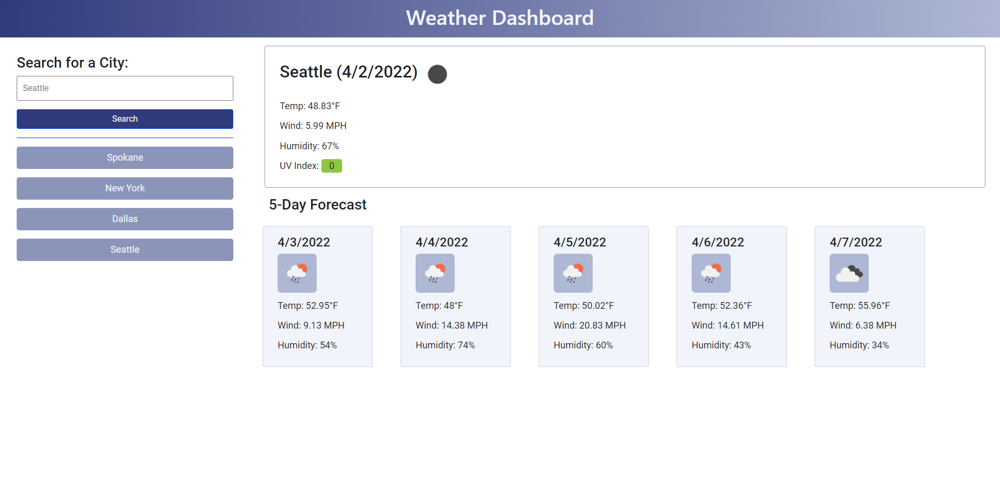

# weather-dashboard

This is a single-page application that delivers the weather forecast to a user's selected location.

## Purpose

The purpose of this project was to practice using third-party APIs to retrieve data to use in my work.

## Goal

The goal of this project was to deliver a dynamic webpage that forecasts the weather for a user based on the location they input. The user should be able to input the city they would like to see the weather for and the application should update with that location's weather for the current day and five projected days.

## Deployment

See below for a screenshot of the application as well as a link to the deployed webpage.

https://struelensc.github.io/weather-dashboard/

